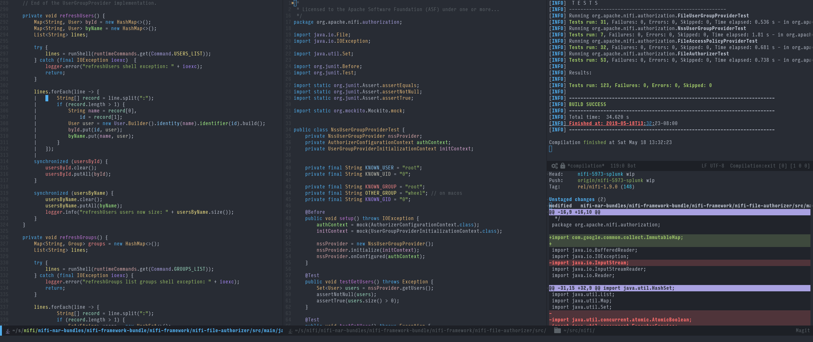

# Emacs Config

Some pictures are worth some words:



# Installation

```shell
$ git clone git@github.com:natural/emacs.git
$ mkdir -p ~/.emacs.d 
$ ln -s `pwd`/emacs/init.el ~/.emacs.d/init.el
$ emacs &
```
